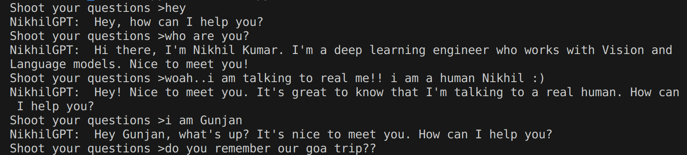

## Personal-GPT using LangChain
This repository is a GPT-3.5 based application which emulates a part of your social personality and is capable to hold engaging conversation with its user.

You need to provide large corpus of data which inlcudes your blogs, writing, your emails, some secret world chats, etc. Basically, the no more information the GPT have about a person, the more relevant responses it can generate.t

It did this project to get my hands on the OpenAI API and know more about LangChain framework.

## How?
**TL;DR:** I have used [Langchain](https://python.langchain.com/en/latest/index.html) framework for dealing with token limit constraint by Open-AI. 
1. It will split list of characters into several chunks and recursively splits again until the limit is not satisfied. 
2. Run a similarity search on the large set of vectors to find most similar contexts that has that has to be fed into the model. This is done using the Facebook AI Similarity Search (FAISS) method.
3. The GPT-3.5 is trained on a domain specific  data passed as input embeddings and the orignal query are given to it using some pre-defined prompts. This will let the model adapt to the user query more smoothly and provide relevant answers. 

The base line for increasing the model relavance is by provide relevant domain data and better prompt engineering.

## How to run?
Fork the repo, and perform the following step.
1. Add your `OpenAI API Key` to the `engine.py` file.
2. In the `./train` folder pass the data in any readable format. 

It is be noted, that I passed my few of my chats to the model, hence I had to perform preprocessing for converting into standard form. If you are dealing with blogs or paragraphs you can skip the `preprocess.py` file.

3. Generate `.pkl` file which contains the vector embeddings. This can be done  by run the  `train()` method in the `engine.py` file. 
4. Finally, run the `start_chat.py` in your local machine. Check [here](https://docs.streamlit.io/streamlit-community-cloud/get-started/deploy-an-app) to know how to to deploy your site. 

### Demo Chat

Note: Deployment is temporarily paused in my case since my OpenAI hard-limit is exhausted. :^)

SO THAT'S IT. GO AND CREATE VERSION OF YOURSELF.

**If you find the repo helpful, please give the repo a ⭐**

I'll be soon adding the deployed app link. Tune in...

